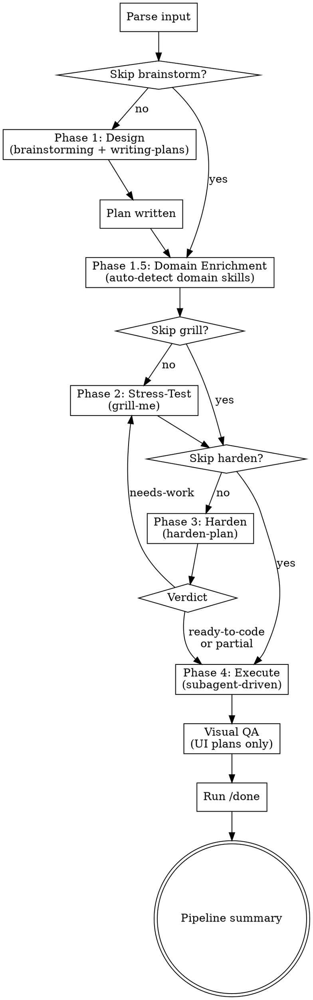

# Forge Plan

Orchestrate skills across 4 phases to go from raw idea to implemented, reviewed code. Heat (brainstorm) + pressure (grill) + quench (harden) + use (execute).

**Do NOT enter Claude Code plan mode.** This skill manages its own phased workflow with write operations in every phase. Plan mode would block file writes needed by brainstorming (spec), writing-plans (plan file), grill-me (plan updates), and execution (code).

Assumes you're already in a git worktree or feature branch. This skill does not create or manage worktrees.

**Announce at start:** "I'm using forge-plan to run the full pipeline: Design → Stress-Test → Harden → Execute."

**Use AskUserQuestion for ALL user-facing decisions** — brainstorming design choices, grill-me questions, harden-plan findings, domain skill confirmation, and skip confirmations. Always present options as cursor-selectable choices, not plain text questions.

**Do NOT commit during the pipeline.** All git commits are done manually by the user after the pipeline completes. Override any sub-skill instructions that include commit steps (brainstorming spec commit, writing-plans plan commit, execution task commits).

## Usage

```
/forge-plan <issue-url-or-description>
/forge-plan --skip-brainstorm <plan-file-path>
/forge-plan --skip-grill <issue-url-or-description>
/forge-plan --skip-harden <plan-file-path>
```

## Phase Flow



## Input Parsing

- **GitHub issue URL** (matches `github.com` or `#\d+`) → fetch with `gh issue view`, use body as topic
- **File path** (file exists on disk) → if it's a spec (in `docs/superpowers/specs/` or has design sections without task checkboxes), run writing-plans first; if it's a plan (in `docs/superpowers/plans/` or has `- [ ]` task checkboxes), skip to Phase 2
- **Free text** → use as topic for brainstorming
- **No input** → ask user what they want to build

## Phase 1: Design

Announce: **"Phase 1 of 4: Design"**

**Reminder before invoking:** Use AskUserQuestion for all design choices — cursor-selectable options, not plain text.

Invoke `superpowers:brainstorming` via Skill tool. Let it run its full 9-step checklist naturally. It will invoke `superpowers:writing-plans` as its terminal action — let that happen too. The plan file is needed for Phase 2 and 3.

When writing-plans reaches its "Execution Handoff" section or presents a choice about how to execute the plan (e.g., "Subagent-Driven vs Inline Execution"):
- **STOP.** Do NOT present that choice to the user. Execution is always subagent-driven.
- Capture the PLAN_FILE path (e.g., `docs/superpowers/plans/YYYY-MM-DD-feature.md`).

**Do NOT ask "does this plan look good?" or wait for user approval.** Phase transitions are automatic — the grill phase (Phase 2) IS the approval mechanism. Immediately announce transition to Phase 1.5 (or Phase 2 if domain enrichment is skipped).

## Phase 1.5: Domain Enrichment

After Phase 1 produces a plan file, auto-detect relevant domain skills based on the plan's content.

**Detection heuristics** (scan plan file for keywords):
- UI/React/components/pages/design → `frontend-design:frontend-design`
- Remotion/video/animation → `remotion-best-practices`
- Next.js/app router/RSC → `next-best-practices`
- Landing page/hero/CTA → `landing-page-designer`
- Database/schema/migration/SQL → `supabase-postgres-best-practices`
- Auth/login/session → `better-auth-best-practices`
- Tailwind/styling → `vercel:shadcn`

If domain skills are detected, present them via AskUserQuestion:
> "I suggest running these domain skills on the plan before grilling: [skill-1, skill-2]. Add or remove any?"

Options: "Run these (Recommended)", "Add more", "Skip domain enrichment"

For each confirmed skill, invoke it via Skill tool with the plan file as context. Apply any suggested improvements to the plan file before proceeding to Phase 2.

If no domain skills are detected, skip this phase silently and proceed to Phase 2.

## Phase 2: Stress-Test

Announce: **"Phase 2 of 4: Stress-Testing the Plan"**

**Reminder before invoking:** Use AskUserQuestion for every grill question — cursor-selectable options, not plain text.

Invoke `grill-me` via Skill tool, passing the PLAN_FILE path as context. Reference the plan file explicitly so grill-me knows what to stress-test — do not rely on conversation context alone. It will question every decision branch one at a time.

When grill-me reaches natural completion (no more questions, or user signals done):
- If the grill surfaced changes to the plan, update the plan file before proceeding.
- **Immediately** announce transition to Phase 3. Do NOT wait for approval.

## Phase 3: Harden

Announce: **"Phase 3 of 4: Hardening"**

**Reminder before invoking:** Use AskUserQuestion for every finding presented to the user — cursor-selectable options, not plain text "y/n".

Invoke `harden-plan` via Skill tool, passing the PLAN_FILE path as argument.

Wait for harden-plan's final verdict:
- **ready-to-code** → **immediately** proceed to Phase 4.
- **partial** (open Moderate findings, no Critical/Serious) → inform user of open findings. **Immediately** proceed to Phase 4 unless user explicitly asks to iterate.
- **needs-work** → loop back to Phase 2 (re-grill then re-harden). Do NOT proceed to execution.

The plan file at PLAN_FILE is the source of truth — already saved to disk by writing-plans and updated in place by grill/harden. Execution subagents read it from disk.

## Phase 4: Execute

Announce: **"Phase 4 of 4: Execution"**

Invoke `superpowers:subagent-driven-development` via Skill tool. Do NOT present an execution strategy choice — subagent-driven is always used.

**Before dispatching**, remind the execution skill:
- Do NOT run any `git add`, `git commit`, or `git push` commands. Skip all "Commit" steps in the plan.
- Do NOT invoke `finishing-a-development-branch` when tasks complete. Return control to forge-plan immediately.

## Post-Execution Verification

### Visual QA (UI plans only)

If the plan involved visual output (UI components, Remotion video, landing pages, design changes), run a visual QA step BEFORE `/done`:

1. **Identify key visual checkpoints** from the plan (hero moments, critical screens, state transitions)
2. **Render/capture checkpoints:**
   - Remotion plans: render still frames at key beat timestamps via `remotion still`
   - React/Next.js plans: navigate to affected pages via Playwright MCP or dev server
   - Landing pages: screenshot above-the-fold and key sections
3. **Review each checkpoint visually** — read the image files and verify:
   - Layout alignment matches plan spec
   - Brand assets (logos, colors, fonts) are correct variants
   - Text content matches plan copy (domains, taglines, CTAs)
   - Interactive states are correct (checked/unchecked, active/inactive)
4. **Report issues** found and fix before proceeding to `/done`

Skip this step for non-visual plans (API, CLI, database, backend services).

### /done verification

Run `/done` to verify the implementation:
- Type-check loop until clean (`/fix-ts-errors`)
- Parallel code review (`/parallel-review` — code-reviewer + coderabbit)
- Code simplification check (`/simplify`)
- Correctness verification
- Commit message suggestions

Do NOT print the pipeline summary until `/done` completes.

## Skip Mechanisms

- **`--skip-brainstorm`**: Input must be a file path. If it's a spec → run writing-plans on it first (only brainstorming exploration is skipped; still capture the PLAN_FILE path and suppress execution choice when writing-plans finishes). If it's already a plan → skip directly to Phase 1.5 (Domain Enrichment).
- **`--skip-grill`**: Skip Phase 2, go directly to Phase 3. Confirm via AskUserQuestion: "Skipping stress-test — this phase catches ambiguity and missing decisions. Sure?" with options "Yes, skip" and "No, run the grill".
- **`--skip-harden`**: Skip Phase 3, go directly to Phase 4. Input must be a plan file path. Use when resuming with an already-hardened plan from a previous session.
- **Runtime skip**: At any phase announcement, user can say "skip this". Confirm before skipping.
- **Pipeline abort**: If user says "abort", "stop", or "cancel the pipeline" at any point — stop the current phase, print the pipeline summary with completed phases marked "done" and remaining phases marked "aborted", and exit.

## Pipeline Summary

Print after all phases complete:

```
## forge-plan Complete

| Phase | Status |
|-------|--------|
| 1. Design | done |
| 1.5. Domain Enrichment | done / skipped |
| 2. Stress-Test | done / skipped |
| 3. Harden | done — <ready-to-code / partial / needs-work> |
| 4. Execute | done — all tasks complete |

**Spec:** <spec-path>
**Plan:** <plan-path>

Implementation complete. Run `superpowers:finishing-a-development-branch` when ready to ship.
```
