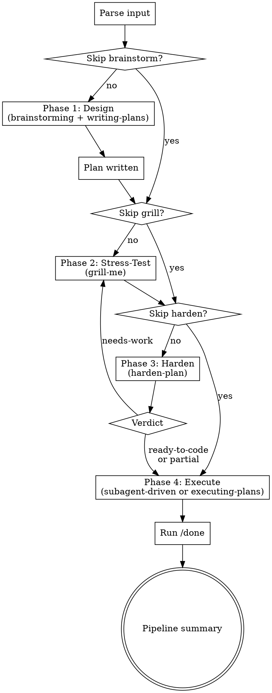

# Forge Plan

Orchestrate 6 skills across 4 phases to go from raw idea to implemented, reviewed code. Heat (brainstorm) + pressure (grill) + quench (harden) + use (execute).

**Do NOT enter Claude Code plan mode.** This skill manages its own phased workflow with write operations in every phase. Plan mode would block file writes needed by brainstorming (spec), writing-plans (plan file), grill-me (plan updates), and execution (code).

Assumes you're already in a git worktree or feature branch. This skill does not create or manage worktrees.

**Announce at start:** "I'm using forge-plan to run the full pipeline: Design → Stress-Test → Harden → Execute."

**Use AskUserQuestion for ALL user-facing decisions** — brainstorming design choices, grill-me questions, harden-plan findings, execution choice, and skip confirmations. Always present options as cursor-selectable choices, not plain text questions.

**Do NOT commit during the pipeline.** All git commits are done manually by the user after the pipeline completes. Override any sub-skill instructions that include commit steps (brainstorming spec commit, writing-plans plan commit, execution task commits).

## Usage

```
/forge-plan <issue-url-or-description>
/forge-plan --skip-brainstorm <plan-file-path>
/forge-plan --skip-grill <issue-url-or-description>
```

## Phase Flow



## Input Parsing

- **GitHub issue URL** (matches `github.com` or `#\d+`) → fetch with `gh issue view`, use body as topic
- **File path** (file exists on disk) → if it's a spec (in `docs/superpowers/specs/` or has design sections without task checkboxes), run writing-plans first; if it's a plan (in `docs/superpowers/plans/` or has `- [ ]` task checkboxes), skip to Phase 2
- **Free text** → use as topic for brainstorming
- **No input** → ask user what they want to build

## Phase 1: Design

Announce: **"Phase 1 of 4: Design"**

Invoke `superpowers:brainstorming` via Skill tool. Let it run its full 9-step checklist naturally. It will invoke `superpowers:writing-plans` as its terminal action — let that happen too. The plan file is needed for Phase 2 and 3.

<INTERCEPT>
When writing-plans reaches its "Execution Handoff" section — or more generally, when any sub-skill presents a choice about how to execute the plan (e.g., "Subagent-Driven vs Inline Execution"):
- **STOP.** Do NOT present that choice to the user.
- Capture the PLAN_FILE path (e.g., `docs/superpowers/plans/YYYY-MM-DD-feature.md`).
- Announce transition to Phase 2.
</INTERCEPT>

## Phase 2: Stress-Test

Announce: **"Phase 2 of 4: Stress-Testing the Plan"**

Invoke `grill-me` via Skill tool. The plan from Phase 1 is already in conversation context — grill-me will naturally pick it up. It will question every decision branch one at a time.

When grill-me reaches natural completion (no more questions, or user signals done):
- If the grill surfaced changes to the plan, update the plan file before proceeding.
- Announce transition to Phase 3.

## Phase 3: Harden

Announce: **"Phase 3 of 4: Hardening"**

Invoke `harden-plan` via Skill tool, passing the PLAN_FILE path as argument.

Wait for harden-plan's final verdict:
- **ready-to-code** → proceed to Phase 4
- **partial** (open Moderate findings, no Critical/Serious) → inform user of open findings. Proceed to Phase 4 unless user wants to iterate.
- **needs-work** → loop back to Phase 2 (re-grill then re-harden). Do NOT proceed to execution.

The plan file at PLAN_FILE is the source of truth — already saved to disk by writing-plans and updated in place by grill/harden. Execution subagents read it from disk.

## Phase 4: Execute

Announce: **"Phase 4 of 4: Execution"**

Present execution choice to user:
- **Option A: Subagent-Driven (recommended)** — `superpowers:subagent-driven-development`. Fresh subagent per task with two-stage review (spec compliance then code quality).
- **Option B: Inline Execution** — `superpowers:executing-plans`. Batch execution with checkpoints.

Invoke the chosen skill.

<INTERCEPT>
The execution skill's terminal action is to invoke `finishing-a-development-branch`. Do NOT allow this invocation. When all tasks are complete, immediately take control back and proceed to Post-Execution Verification.
</INTERCEPT>

## Post-Execution Verification

After Phase 4 execution completes, run `/done` to verify the implementation:
- Type-check loop until clean (`/fix-ts-errors`)
- Parallel code review (`/parallel-review` — code-reviewer + coderabbit)
- Code simplification check (`/simplify`)
- Correctness verification
- Commit message suggestions

Do NOT print the pipeline summary until `/done` completes.

## Skip Mechanisms

- **`--skip-brainstorm`**: Input must be a file path. If it's a spec → run writing-plans on it first (only brainstorming exploration is skipped; the Phase 1 INTERCEPT still applies). If it's already a plan → skip directly to Phase 2.
- **`--skip-grill`**: Skip Phase 2, go directly to Phase 3. Confirm first: "Skipping stress-test — this phase catches ambiguity and missing decisions. Sure? (y/n)"
- **`--skip-harden`**: Skip Phase 3, go directly to Phase 4. Input must be a plan file path. Use when resuming with an already-hardened plan from a previous session.
- **Runtime skip**: At any phase announcement, user can say "skip this". Confirm before skipping.
- **Pipeline abort**: If user says "abort", "stop", or "cancel the pipeline" at any point — stop the current phase, print the pipeline summary with completed phases marked "done" and remaining phases marked "aborted", and exit.

## Pipeline Summary

Print after all phases complete:

```
## forge-plan Complete

| Phase | Status |
|-------|--------|
| 1. Design | done |
| 2. Stress-Test | done / skipped |
| 3. Harden | done — <verdict> |
| 4. Execute | done — all tasks complete |

**Spec:** <spec-path>
**Plan:** <plan-path>

Implementation complete. Run `superpowers:finishing-a-development-branch` when ready to ship.
```
